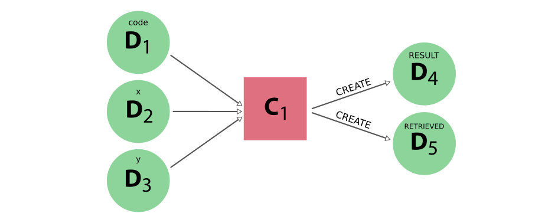

************
Calculations
************

.. _concepts_calculations:

=======
Concept
=======

A calculation is a process (see the :ref:`process section<concepts_processes>` for details) that *creates* new data.
Currently, there are two ways of implementing a calculation process:

 * :ref:`calculation function<concepts_calcfunctions>`
 * :ref:`calculation job<concepts_calcjobs>`

The first one is the simplest of the two and is basically a python function that is magically transformed into a process.
This is ideal for calculations that are not very computationally intensive and can be easily implemented in a python function.
For more taxing calculations, typically performed by external codes that are optionally run on remote computing clusters, the calculation job is the better alternative.

In the following sections, both concepts will be explained but without going too much into detail on how to implement or run them.
For a more detailed exposé, please refer to the respective advanced sections on :ref:`calculation functions<working_calcfunctions>` and :ref:`calculation jobs<working_calcjobs>`.

.. _concepts_calcfunctions:

Calculation functions
=====================

Consider the following computational task at hand:

.. highlights::
    Given three integers, add the first two and then multiply the sum by the third.

In plain python code, the solution would look something like the following:

.. include:: include/snippets/calculations/calcfunctions/add_multiply_plain_python.py
    :code: python

This simple code snippet will achieve the goal of getting the desired result, however, the provenance is lost.
There is no connection between the output of the functions and their inputs.
The remedy to this problem is the :py:func:`~aiida.engine.processes.functions.calcfunction`.
The ``calcfunction`` in AiiDA is a `function decorator <https://docs.python.org/3/glossary.html#term-decorator>`_ that transforms a regular python function in a calculation process, which automatically stores the provenance of its output in the :ref:`provenance graph<concepts_provenance>` when executed.
Updating the previous snippet with ``calcfunction`` decorators yields:

.. include:: include/snippets/calculations/calcfunctions/add_multiply_calcfunction_decorator.py
    :code: python

The only thing we had to do to decorate the two functions was to add the line ``@calcfunction`` just before the function definition.
Adding the decorator tells AiiDA that the provenance for this function should be stored in the provenance graph when it is executed.
This means linking up the inputs and the outputs for a calculation node, which represents the function that was executed.
The final change that has to be performed to make this possible, is to make the inputs and the outputs storable.
In the previous snippet, the inputs are plain python integer types, which cannot be automatically stored in the provenance graph as nodes.
To solve this, one only has to wrap them in the :py:class:`~aiida.orm.nodes.data.int.Int` node sub class, which makes them storable in the database:

.. include:: include/snippets/calculations/calcfunctions/add_multiply_calcfunction_data_types.py
    :code: python

The only difference with the previous snippet is that all inputs have been wrapped in the :py:class:`~aiida.orm.nodes.data.int.Int` class.
The result that is returned by the function, is now also an :py:class:`~aiida.orm.nodes.data.int.Int` node that can be stored in the provenance graph, and contains the result of the computation.

.. note::

    Since ``x`` and ``y`` inside the ``add`` and ``multiply`` functions are already :py:class:`~aiida.orm.nodes.data.int.Int` instances the sum will also be one.
    This is true because all arithmetic operators also work on the base AiiDA classes (``Int``, ``Float``, etc.) as they would on the equivalent python types.
    It is important to realize though that only :py:class:`~aiida.orm.nodes.node.Node` instances, or sub classes thereof can be stored.
    For more information on how to return results from process functions, refer to the :ref:`advanced section<working_calcfunctions>`.

With these trivial changes, the full provenance of the result produced by running the function is maintained and looks like the following:

.. _fig_calculation_functions_provenance_add_multiply:
.. figure:: include/images/add_multiply_calcfunction_data.png

    The provenance generated by the calcfunction example

The example above already shows how a calcfunction can be run: simply by calling it.
The value that is returned is the result returned by the definition of the function.
However, sometimes one would also like to have a reference to the calculation node that represents the execution of the function in the provenance graph.
The following example shows two additional launch functions that will return a tuple, which in addition to the results, also return the ``pk`` or the node associated with the process

.. include:: include/snippets/calculations/calcfunctions/add_multiply_calcfunction_run.py
    :code: python

This was a very short and limited description of calculation functions.
For a more detailed description of launching them, please refer to the section on :ref:`launching processes<working_processes_launching>`.
If you want more details on implementing calculation functions and best practices, refer to the section on :ref:`working with calculation functions<working_calcfunctions>`.

.. _concepts_calcjobs:

Calculation jobs
================

In the previous section on :ref:`calculation functions<concepts_calcfunctions>`, we showed how a simple python function can be transformed into a process, such that when it is launched, its execution is recorded automatically in the provenance graph.
However, not all computations are well suited to be implemented as a python function, but rather are implemented as a separate code, external to AiiDA.
To interface an external code with the engine of AiiDA, the :py:class:`~aiida.engine.processes.calcjobs.calcjob.CalcJob` process class was introduced.
A detailed explanation of how to implement it, the interface and best practices, can be found in a :ref:`later section<working_calcjobs>`.
Here, instead, we will focus on the big picture and explain in broad lines how a calculation job models the execution of an external code and what tasks it performs when launched.

To illustrate how a calculation job operates, we need an external code.
Let's imagine an external code that consists of a bash script that reads an input file containing two integers, sums them and prints the result in the standard output using ``echo``, for example:

.. code:: bash

    #!/bin/bash
    # Read two integers from file 'aiida.in' and echo their sum
    x=$(cat aiida.in | awk '{print $1}')
    y=$(cat aiida.in | awk '{print $2}')
    echo $(( $x + $y ))

When run, this script reads the contents of a file called ``aiida.in`` and expects that it contains two integers.
It will parse these into the variables ``x`` and ``y`` and then print their sum.
When you want to run this 'code' through AiiDA, you need to tell *how* AiiDA should run it.
The :py:class:`~aiida.calculations.plugins.arithmetic.add.ArithmeticAddCalculation` is a calculation job implementation that forms an interface to accomplish exactly that for the example bash script.
A ``CalcJob`` implementation for a specific code, often referred to as a calculation plugin, essentially instructs the engine how it should be run.
This includes how the necessary input files should be created based on the inputs that it receives, how the code executable should be called and what files should be retrieved when the calculation is complete.
Note the files should be 'retrieved' because calculation jobs can be run not just on the localhost, but on any :ref:`computer that is configured in AiiDA<setup_computer>`, including remote machines accessible over for example SSH.

Since a ``CalcJob`` is a process just like the :ref:`calculation functions<concepts_calcfunctions>` described before, they can be run in an identical way.

.. include:: include/snippets/calculations/calcjobs/arithmetic_add_run.py
    :code: python

the provenance generated by running the calculation job will look something like this:

.. _fig_calculation_jobs_provenance_arithmetic_add:

    The provenance generated by the calculation job example

The execution of the calculation job is represented in the provenance graph by a process node, i.e. the pink square labeled `C\ :sub:`1`` in :numref:`fig_calculation_jobs_provenance_arithmetic_add`.
The integer data nodes ``x`` and ``y`` that were passed as inputs are linked to the calculation job as such, as well as the third input ``code``.
This input is required for *all* calculation jobs as it represents the external code that is actually executed.
These code nodes are instances of the :py:class:`~aiida.orm.nodes.data.code.Code` class, which is a sub-class of :py:class:`~aiida.orm.nodes.data.data.Data`.
This means that code instances are a sort of data node.
Its function is to record the path to the executable and some other code related attributes defined during the :ref:`code setup<setup_code>`.

The calculation job produced two outputs, an integer node, containing the sum of ``x`` and ``y`` and a :py:class:`~aiida.orm.nodes.data.folder.FolderData` node, containing the output files that were retrieved.
Note that all outputs of calculation jobs (except for the ``retrieved`` node) are technically not created by the calculation job itself, but rather by an implementation of the :py:class:`~aiida.parsers.parser.Parser` class.
In principle, this step is optional, and so a calculation job is therefore not required to produce any outputs, except for the ``retrieved`` folder data node, which will always be there.
How the parser fits into the concept of calculation jobs will be addressed in :ref:`this section<concepts_calcjobs_parsers>`.

.. _concepts_calcjobs_transport_tasks:

Transport tasks
---------------

To arrive at the provenance graph shown above in :numref:`fig_calculation_jobs_provenance_arithmetic_add`, the engine performed quite some tasks.
When a calculation job is launched, the engine will take it roughly through the following steps:

 * **Upload**: the calculation job implementation is used to transform the input nodes into the required input files, which are uploaded to a 'working' directory on the target machine
 * **Submit**: to execute the calculation, a job is submitted to the scheduler of the computer on which the input `code` is configured.
 * **Update**: the engine will query the scheduler to check for the status of the calculation job
 * **Retrieve**: once the job has finished, the engine will retrieve the output files, specified by the plugin and store them in a node attached as an output node to the calculation

All of these tasks require the engine to interact with the computer, or machine, that will actually run the external code.
Since the :py:class:`~aiida.orm.nodes.data.code.Code` that is used as an input for the calculation job, which is configured for a specific :py:class:`~aiida.orm.computers.Computer`, the engine knows exactly how to execute all these tasks.
The ``CalcJob`` implementation itself then is completely independent of the machine the code will be run on.
To run the calculation job on a different machine, all you have to do is change the ``code`` input to one that is configured for that machine.
If the machine is *not* the localhost, the engine will need a way to connect to the remote machine in order to perform each of the four tasks listed above.
The mechanism that allows the engine to connect to the remote machine is called a *transport* and therefore the tasks it performs using this transport are called *transport tasks*.

.. _concepts_calcjobs_exponential_backoff:

Exponential backoff mechanism
-----------------------------

In the case of calculation jobs being executed on a remote machine, the engine will have to connect to the machine for each of the transport tasks.
In connecting to the remote, a whole host of potential problems may occur that would cause the calculation job to fail.
For example, the remote machine may be down and as a result unreachable, or the engine itself may lose its internet connection.
However, these problems are often temporary.
To prevent the calculation job from excepting and it being lost forever, an *exponential backoff mechanism* has been implemented.
Whenever the engine performs a transport task but encounters an exception, instead of letting the calculation job fail, it will reschedule the same task to be executed again at a later time.
The task will be automatically rescheduled until it finishes successfully, where the interval between tries increases exponentially.
If after 5 consecutive tries, the task still fails, instead of rescheduling it, the engine will simply pause the calculation job.
The output of ``verdi process list`` will give more information on why the task failed:

.. code-block:: bash

      PK  Created     State           Process label                 Process status
    ----  ----------  ------------    --------------------------    ---------------------------------------------------------------------------------------
     151  1h ago      ⏸ Waiting       ArithmeticAddCalculation      Pausing after failed transport task: retrieve_calculation failed 5 times consecutively

    Total results: 1

When there are calculation jobs that have been paused because the transport tasks have failed multiple times, the user has the time to investigate the problem.
If the problem is determined to be temporary and it has been resolved, one can use ``verdi process play`` to resume the paused processes.
The engine will then automatically reschedule the task that failed last and the calculation job will continue where it left off.

This exponential backoff mechanism makes the engine very robust with respect to calculation jobs, reducing the loss of computational resources due to temporary problems to an absolute minimum.

.. note::

    The parameters, such as the delays between retries and the maximum number of retries, are currently not configurable, but they might be in the future.

.. _concepts_calcjobs_parsers:

Parsers
-------
The previous section explained how the ``CalcJob`` class functions as an interface between AiiDA's engine and an external piece of code.
The calculation job plugin will instruct the engine how the :ref:`transport tasks<concepts_calcjobs_transport_tasks>` should be accomplished.
However, as mentioned before, those tasks stop after the output files have been retrieved, which the engine will attach as a :py:class:`~aiida.orm.nodes.data.folder.FolderData` node with the label ``'retrieved'`` to the calculation job node.
As far as the calculation job goes that is all that is absolutely required.
However, often one wants to parse those output files into some specific outputs that should be represented as individual nodes in the provenance graph.
This can be accomplished by implementing the :py:class:`~aiida.parsers.parser.Parser` class and specifying it in the inputs of the calculation job.
In that case, the engine will call the parser after the output files created by the job have been successfully retrieved.
In the parser implementation, the retrieved files can then be parsed and converted into output nodes.
For technical details on how to implement a parser for a calculation job and how to specify it in the inputs, please refer to the :ref:`detailed parser section<working_calcjobs_parsers>`,

.. _working_calculations:

===========
Application
===========

A calculation is a process (see the :ref:`process section<concepts_processes>` for details) that *creates* new data.
Currently, there are two ways of implementing a calculation process:

 * :ref:`calculation function<working_calcfunctions>`
 * :ref:`calculation job<working_calcjobs>`

This section will provide detailed information and best practices on how to implement these two calculation types.

.. warning::
    This chapter assumes that the basic concept and difference between calculation functions and calculation jobs is known and when one should use on or the other.
    It is therefore crucial that, before you continue, you have read and understood the basic concept of :ref:`calculation processes<concepts_calculations>`.

.. _working_calcfunctions:

Calculation functions
=====================

The section on the :ref:`concept of calculation functions<concepts_calcfunctions>` already addressed their aim: automatic recording of their execution with their inputs and outputs in the provenance graph.
The :ref:`section on process functions<working_process_functions>` subsequently detailed the rules that apply when implementing them, all of which to calculation functions, which are a sub type, just like work functions.
However, there are some differences given that calculation functions are 'calculation'-like processes and work function behave like 'workflow'-like processes.
What this entails in terms of intended usage and limitations for calculation functions is the scope of this section.

Creating data
-------------
It has been said many times before: calculation functions, like all 'calculation'-like processes, `create` data, but what does `create` mean exactly?
In this context, the term 'create' is not intended to refer to the simple creation of a new data node in the graph, in an interactive shell or a script for example.
But rather it indicates the creation of a new piece of data from some other data through a computation implemented by a process.
This is then exactly what the calculation function does.
It takes one or more data nodes as inputs and returns one or more data nodes as outputs, whose content is based on those inputs.
As explained in the :ref:`technical section<working_process_functions>`, outputs are created simply by returning the nodes from the function.
The engine will inspect the return value from the function and attach the output nodes to the calculation node that represents the calculation function.
To verify that the output nodes are in fact 'created', the engine will check that the nodes are not stored.
Therefore, it is very important that you **do not store the nodes you create yourself**, or the engine will raise an exception, as shown in the following example:

.. include:: include/snippets/calculations/calcfunctions/add_calcfunction_store.py
    :code: python

Because the returned node is already stored, the engine will raise the following exception:

.. code:: bash

    ValueError: trying to return an already stored Data node from a @calcfunction, however, @calcfunctions cannot return data.
    If you stored the node yourself, simply do not call `store()` yourself.
    If you want to return an input node, use a @workfunction instead.

The reason for this strictness is that a node that was stored after being created in the function body, is indistinguishable from a node that was already stored and had simply been loaded in the function body and returned, e.g.:

.. include:: include/snippets/calculations/calcfunctions/add_calcfunction_load_node.py
    :code: python

The loaded node would also have gotten a `create` link from the calculation function, even though it was not really created by it at all.
It is exactly to prevent this ambiguity that calculation functions require all returned output nodes to be *unstored*.

Note that work functions have exactly the opposite required and all the outputs that it returns **have to be stored**, because as a 'workflow'-like process, it *cannot* create new data.
For more details refer to the :ref:`work function section<working_workfunctions>`.

.. _working_calcjobs:

Calculation jobs
================

To explain how a calculation job can be implemented, we will continue with the example presented in the section on the :ref:`concept of the calculation job<concepts_calcjobs>`.
There we described a code that adds two integers, implemented as a simple bash script, and how the :py:class:`~aiida.engine.processes.calcjobs.calcjob.CalcJob` class can be used to run this code through AiiDA.
Since it is a sub class of the :py:class:`~aiida.engine.processes.process.Process` class, it shares all its properties.
It will be very valuable to have read the section on working with :ref:`generic processes<working_processes>` before continuing, because all the concepts explained there will apply also to calculation jobs.

.. _working_calcjobs_define:

Define
------
To implement a calculation job, one simply sub classes the :py:class:`~aiida.engine.processes.calcjobs.calcjob.CalcJob` process class and implements the :py:meth:`~aiida.engine.processes.calcjobs.calcjob.CalcJob.define` method.
You can pick any name that is a valid python class name.
The most important method of the ``CalcJob`` class, is the ``define`` class method.
Here you define, what inputs it takes and what outputs it will generate.

.. include:: include/snippets/calculations/calcjobs/arithmetic_add_spec_inputs.py
    :code: python

As the snippet above demonstrates, the class method takes two arguments:

 * ``cls`` this is the reference of the class itself and is mandatory for any class method
 * ``spec`` which is the 'specification'

.. warning::
    Do not forget to add the line ``super(ArithmeticAddCalculation, self).define(spec)`` as the first line of the ``define`` method, where you replace the class name with the name of your calculation job.
    This will call the ``define`` method of the parent class, which is necessary for the calculation job to work properly

As the name suggests, the ``spec`` can be used to specify the properties of the calculation job.
For example, it can be used to define inputs that the calculation job takes.
In our example, we need to be able to pass two integers as input, so we define those in the spec by calling ``spec.input()``.
The first argument is the name of the input.
This name should be used later to specify the inputs when launching the calculation job and it will also be used as the label for link to connect the data node and the calculation node in the provenance graph.
Additionally, as we have done here, you can specify which types are valid for that particular input.
Since we expect integers, we specify that the valid type is the database storable :py:class:`~aiida.orm.nodes.data.int.Int` class.

.. note::

    Since we sub class from ``CalcJob`` and call its ``define`` method, it will inherit the ports that it declares as well.
    If you look at the implementation, you will find that the base class ``CalcJob`` already defines an input ``code`` that takes a ``Code`` instance.
    This will reference the code that the user wants to run when he launches the ``CalcJob``.
    For this reason, you **do not** again have to declare this input.

Next we should define what outputs we expect the calculation to produce:

.. include:: include/snippets/calculations/calcjobs/arithmetic_add_spec_outputs.py
    :code: python

Just as for the inputs, one can specify what node type each output should have.
By default a defined output will be 'required', which means that if the calculation job terminates and the output has not been attached, the process will be marked as failed.
To indicate that an output is optional, one can use ``required=False`` in the ``spec.output`` call.
Note that the process spec, and its :py:meth:`~aiida.engine.processes.process_spec.ProcessSpec.input` and :py:meth:`~aiida.engine.processes.process_spec.ProcessSpec.output` methods provide a lot more functionality.
Fore more details, please refer to the section on :ref:`process specifications<working_processes_spec>`.

.. _working_calcjobs_prepare:

Prepare
-------
We have know defined through the process specification, what inputs the calculation job expects and what outputs it will create.
The final remaining task is to instruct the engine how the calculation job should actually be run.
To understand what the engine would have to do to accomplish this, let's consider what one typically does when manually preparing to run a computing job through a scheduler:

    * Prepare a working directory in some scratch space on the machine where the job will run
    * Create the raw input files required by the executable
    * Create a launch script containing scheduler directives, loading of environment variables and finally calling the executable with certain command line parameters.

So all we need to do now is instruct the engine how to accomplish these things for a specific calculation job.
Since these instructions will be calculation dependent, we will implement this with the :py:meth:`~aiida.engine.processes.calcjobs.calcjob.CalcJob.prepare_for_submission` method.
The implementation of the ``ArithmeticAddCalculation`` that we are considering in the example looks like the following:

.. include:: include/snippets/calculations/calcjobs/arithmetic_add_spec_prepare_for_submission.py
    :code: python

Before we go into the code line-by-line, let's describe the big picture of what is happening here.
The goal of this method is to help the engine accomplish the three steps required for preparing the submission a calculation job, as described above.
The raw input files that are required can be written to a sandbox folder that is passed in as the ``folder`` argument.
All the other required information, such as the directives of which files to copy and what command line options to use are defined through the :py:class:`~aiida.common.datastructures.CalcInfo` datastructure, which should be returned from the method as the only value.
In principle, this is what one **should do** in the ``prepare_for_submission`` method:

    * Writing raw inputs files required for the calculation to run to the ``folder`` sandbox folder.
    * Use a ``CalcInfo`` to instruct the engine which files to copy to the working directory
    * Use a ``CalcInfo`` to tell which codes should run, using which command line parameters, such as standard input and output redirection.

.. note::

    The ``prepare_for_submission`` does not have to write the submission script itself.
    The engine will know how to do this, because the codes that are to be used have been configured on a specific computer, which defines what scheduler is to be used.
    This gives the engine all the necessary information on how to write the launch script such as what scheduler directives to write.

Now that we know what the ``prepare_for_submission`` is expected to do, let's see how the implementation of the ``ArithmeticAddCalculation`` accomplishes it line-by-line.
The input file required for this example calculation will consist of the two integers that are passed as inputs.
The ``self.inputs`` attribute returns an attribute dictionary with the parsed and validated inputs, according to the process specification defined in the ``define`` method.
This means that you do not have to validate the inputs yourself.
That is to say, if an input is marked as required and of a certain type, by the time we get to the ``prepare_for_submission`` it is guaranteed that the dictionary returned by ``self.inputs`` will contain that input and of the correct type.

From the two inputs ``x`` and ``y`` that will have been passed when the calculation job was launched, we should now generate the input file, that is simply a text file with these two numbers on a single line, separated by a space.
We accomplish this by opening a filehandle to the input file in the sandbox folder and write the values of the two ``Int`` nodes to the file.

.. note::

    The format of this input file just so happens to be the format that the :ref:`bash script<concepts_calcjobs>` expects that we are using in this example.
    The exact number of input files and their content will of course depend on the code for which the calculation job is being written.

With the input file written, we now have to create an instance of :py:class:`~aiida.common.datastructures.CalcInfo` that should be returned from the method.
This data structure will instruct the engine exactly what needs to be done to execute the code, such as what files should be copied to the remote computer where the code will be executed.
In this simple example, we define four simple attributes:

    * ``codes_info``: a list of :py:class:`~aiida.common.datastructures.CodeInfo` datastructures, that tell which codes to run consecutively during the job
    * ``local_copy_list``: a list of tuples that instruct what files to copy to the working directory from the local machine
    * ``remote_copy_list``: a list of tuples that instruct what files to copy to the working directory from the machine on which the job will run
    * ``retrieve_list``: a list of tuples instructing which files should be retrieved from the working directory and stored in the local repository after the job has finished

In this example we only need to run a single code, so the ``codes_info`` list has a single ``CodeInfo`` datastructure.
This datastructure needs to define which code it needs to run, which is one of the inputs passed to the ``CalcJob``, and does so by means of its UUID.
Through the ``stdout_name`` attribute, we tell the engine where the output of the executable should be redirected to.
In this example this is set to the value of the  ``output_filename`` option.
What options are available in calculation jobs, what they do and how they can be set will be explained in the :ref:`section on options<working_calcjobs_options>`.
Finally, the ``cmdline_params`` attribute takes a list with command line parameters that will be placed *after* the executable in the launch script.
Here we use it to explicitly instruct the executable to read its input from the filename stored in the option ``input_filename``.

.. note::

    Since we instruct the executable should read the input from ``self.options.input_filename``, this is also the filename we used when writing that very input file in the sandbox folder.

Finally, we have to define the various "file lists" that tell what files to copy from where to where and what files to retrieve.
Here we will briefly describe their intended goals.
The implementation details will be described in full in the :ref:`file lists section<working_calcjobs_file_lists>`.

The local copy list is useful to instruct the engine to copy over files that you might already have stored in your database, such as instances of :py:class:`~aiida.orm.nodes.data.singlefile.SinglefileData` nodes, that you can define and pass as inputs of the ``CalcJob``.
You could have of course many copied their content to the ``folder`` sandbox folder, which will also have caused them to be written to the working directory.
The disadvantage of that method, however, is that all the contents written to the sandbox folder will also be stored in the repository of the ``CalcJobNode`` that will represent the execution of the ``CalcJob`` in the provenance graph.
This will cause duplication of the data contained within these data nodes.
By not writing them explicitly to the sandbox folder, you avoid this duplication, without losing provenance, because the data node itself will of course be recorded in the provenance graph.

The remote copy list is useful to avoid unnecessary file transfers between the machine where the engine runs and where the calculation jobs are executed.
For example, imagine you have already completed a calculation job on a remote cluster and now want to launch a second one, that requires some of the output files of the first run as its inputs.
The remote copy list allows you to specify exactly what output files to copy to the remote working directory, without them having to be retrieved to the engine's machine in between.

The retrieve list, finally, allows you to instruct the engine what files should be retrieved from the working directory after the job has terminated.
These files will be downloaded to the local machine, stored in a :py:class:`~aiida.orm.nodes.data.folder.FolderData` data node and attached as an output to the ``CalcJobNode`` with the link label ``retrieved``.

.. note::

    We didn't explicitly define the ``retrieved`` folder data node as an output in the example ``ArithmeticAddCalculation`` implementation shown above.
    This is because this is already defined by the ``CalcJob`` base class.
    Just as the ``code`` input, the ``retrieved`` output is common for all calculation job implementations.

.. _working_calcjobs_file_lists:

File lists
----------

.. _working_calcjobs_file_lists_local_copy:

Local copy list
~~~~~~~~~~~~~~~
The local copy list takes tuples of length three, each of which represents a file to be copied, defined through the following items:

    * `node uuid`: the node whose repository contains the file, typically a ``SinglefileData`` or ``FolderData`` node
    * `source relative path`: the relative path of the file within the node repository
    * `target relative path`: the relative path within the working directory to which to copy the file

As an example, consider a ``CalcJob`` implementation that receives a ``SinglefileData`` node as input with the name ``pseudopotential``, to copy its contents one can specify:

.. code:: python

    calc_info.local_copy_list = [(self.inputs.pseudopotential.uuid, self.inputs.pseudopotential.filename, 'pseudopotential.dat')]

The ``SinglefileData`` node only contains a single file by definition, the relative path of which is returned by the ``filename`` attribute.
If instead, you need to transfer a specific file from a ``FolderData``, you can specify the explicit key of the file, like so:

.. code:: python

    calc_info.local_copy_list = [(self.inputs.folder.uuid, 'internal/relative/path/file.txt', 'relative/target/file.txt')]

Note that the filenames in the relative source and target path need not be the same.
This depends fully on how the files are stored in the node's repository and what files need to be written to the working directory.

.. _working_calcjobs_file_lists_remote_copy:

Remote copy list
~~~~~~~~~~~~~~~~
The remote copy list takes tuples of length three, each of which represents a file to be copied on the remote machine where the calculation will run, defined through the following items:

    * `computer uuid`: this is the UUID of the ``Computer`` on which the source file resides. For now the remote copy list can only copy files on the same machine where the job will run.
    * `source absolute path`: the absolute path of the source file on the remote machine
    * `target relative path`: the relative path within the working directory to which to copy the file

.. code:: python

    calc_info.remote_copy_list[(self.inputs.parent_folder.computer.uuid, 'output_folder', 'restart_folder')]

Note that the source path can point to a directory, in which case its contents will be recursively copied in its entirety.

.. _working_calcjobs_file_lists_retrieve:

Retrieve list
~~~~~~~~~~~~~
The retrieve list supports various formats to define what files should be retrieved.
The simplest is retrieving a single file, whose filename you know before hand and you simply want to copy with the same name in the retrieved folder.
Imagine you want to retrieve the files ``output1.out`` and ``output_folder/output2.out`` you would simply add them as strings to the retrieve list:

.. code:: python

    calc_info.retrieve_list = ['output1.out', 'output_folder/output2.out']

The retrieved files will be copied over keeping the exact names and hierarchy.
If you require more control over the hierarchy and nesting, you can use tuples of length three instead, with the following items:

    * `source relative path`: the relative path, with respect to the working directory on the remote, of the file or directory to retrieve
    * `target relative path`: the relative path where to copy the files locally in the retrieved folder. The string `'.'` indicates the top level in the retrieved folder.
    * `depth`: the number of levels of nesting in the folder hierarchy to maintain when copying, starting from the deepest file

For example, imagine the calculation will have written a file in the remote working directory with the folder hierarchy ``some/remote/path/files/output.dat``.
If you want to copy the file, with the final resulting path ``path/files/output.dat``, you would specify:

.. code:: python

    calc_info.retrieve_list = [('some/remote/path/files/output.dat', '.', 2)]

The depth of two, ensures that only two levels of nesting are copied.
If the output files have dynamic names that one cannot know beforehand, the ``'*'`` glob pattern can be used.
For example, if the code will generate a number of XML files in the folder ``relative/path/output`` with filenames that follow the pattern ``file_*[0-9].xml``, you can instruct to retrieve all of them as follows:

.. code:: python

    calc_info.retrieve_list = [('relative/path/output/file_*[0-9].xml', '.', 1)]

The second item when using globbing *has* to be ``'.'`` and the depth works just as before.
In this example, all files matching the globbing pattern will be copied in the directory ``output`` in the retrieved folder data node.

Retrieve temporary list
~~~~~~~~~~~~~~~~~~~~~~~
Recall that, as explained in the :ref:`'prepare' section<working_calcjobs_prepare>`, all the files that are retrieved by the engine following the 'retrieve list', are stored in the ``retrieved`` folder data node.
This means that any file you retrieve for a completed calculation job will be stored in your repository.
If you are retrieving big files, this can cause your repository to grow significantly.
Often, however, you might only need a part of the information contained in these retrieved files.
To solve this common issue, there is the concept of the 'retrieve temporary list'.
The specification of the retrieve temporary list is identical to that of the normal :ref:`retrieve list<working_calcjobs_file_lists_retrieve>`.
The only difference is that, unlike the files of the retrieve list which will be permanently stored in the retrieved :py:class:`~aiida.orm.nodes.data.folder.FolderData` node, the files of the retrieve temporary list will be stored in a temporary sandbox folder.
This folder is then passed to the :ref:`parser<working_calcjobs_parsers>`, if one was specified for the calculation job.
The parser implementation can then parse these files and store the relevant information as output nodes.
After the parser terminates, the engine will take care to automatically clean up the sandbox folder with the temporarily retrieved files.
The contract of the 'retrieve temporary list' is essentially that the files will be available during parsing and will be destroyed immediately afterwards.

.. _working_calcjobs_options:

Options
-------
In addition to the common metadata inputs, such as ``label`` and ``description``, that all processes have, the :py:class:`~aiida.engine.processes.calcjobs.calcjob.CalcJob` has an additonal input called ``options``.
These options allow to subtly change the behavior of the calculation job, for example which parser should be used once it is finished and special scheduler directives.
The full list of available options are documented below as part of the ``CalcJob`` interface:

.. aiida-calcjob:: CalcJob
    :module: aiida.engine.processes.calcjobs

.. _working_calcjobs_launch:

Launch
------

Launching a calculation job is no different from launching any other process class, so please refer to the section on :ref:`launching processes<working_processes_launch>`.
The only caveat that we should place is that calculation jobs typically tend to take quite a bit of time.
The trivial example we used above of course will run very fast, but a typical calculation job that will be submitted to a scheduler will most likely take longer than just a few seconds.
For that reason it is highly advisable to **submit** calculation jobs instead of running them.
By submitting them to the daemon, you free up your interpreter straight away and the process will be checkpointed between the various :ref:`transport tasks<concepts_calcjobs_transport_tasks>` that will have to be performed.
The exception is of course when you want to run a calculation job locally for testing or demonstration purposes.

.. _working_calcjobs_dry_run:

Dry run
-------
The calculation job has one additional feature over all other processes when it comes to launching them.
Since an incorrectly configured calculation job can potentially waste computational resources, one might want to inspect the input files that will be written by the plugin, before actually submitting the job.
A so-called dry-run is possible by simply specifying it in the metadata of the inputs.
If you are using the process builder, it is as simple as:

.. code:: python

    builder.metadata.dry_run = True

When you now launch the process builder, the engine will perform the entire process of a normal calculation job run, except that it will not actually upload and submit the job to the remote computer.
However, the ``prepare_for_submission`` method will be called.
The inputs that it writes to the input folder will be stored in temporary folder called ``submit_test`` that will be created in the current working directory.
Each time you perform a dry-run, a new sub folder will be created in the ``submit_test`` folder, which you allows you to perform multiple dry-runs without overwriting the previous results.

Moreover, the following applies:

- when calling :py:func:`~aiida.engine.launch.run` for a calculation with the
  ``dry_run`` flag set, you will get back its results, being always an empty dictionary ``{}``;

- if you call :py:func:`~aiida.engine.launch.run_get_node`, you will get back as a node
  an unstored ``CalcJobNode``. In this case, the unstored ``CalcJobNode`` (let's call it
  ``node``) will have an additional property ``node.dry_run_info``. This is a dictionary
  that contains additional information on the dry-run output. In particular, it will have
  the following keys:

  - ``folder``: the absolute path to the folder within the ``submit_test`` folder
    where the files have been created, e.g.: ``/home/user/submit_test/20190726-00019``

  - ``script_filename``: the filename of the submission script that AiiDA generated
    in the folder, e.g.: ``_aiidasubmit.sh``

- if you send a dry-run to the :py:func:`~aiida.engine.launch.submit` function,
  this will be just forwarded to run and you will get back the unstored node
  (with the same properties as above).

.. warning::

    By default the storing of provenance is enabled and this goes also for a dry run.
    If you do not want any nodes to be created during a dry run, simply set the metadata input ``store_provenance`` to ``False``.

.. _working_calcjobs_parsers:

Parsing
-------
The previous sections explained in detail how the execution of an external executable is wrapped by the ``CalcJob`` class to make it runnable by AiiDA's engine.
From the first steps of preparing the input files on the remote machine, to retrieving the relevant files and storing them in a :py:class:`~aiida.orm.nodes.data.folder.FolderData` node, that is attached as the ``retrieved`` output.
This is the last *required* step for a ``CalcJob`` to terminate, but often we would *like* to parse the raw output and attach them as queryable output nodes to the calculation job node.
To automatically trigger the parsing of a calculation job after its output has been retrieved, is to specify the :ref:`parser name option<working_calcjobs_options>`.
If the engine find this option specified, it will load the corresponding parser class, which should be a sub class of :py:class:`~aiida.parsers.parser.Parser` and calls its :py:meth:`~aiida.parsers.parser.Parser.parse` method.

To explain the interface of the ``Parser`` class and the ``parse`` method, let's take the :py:class:`~aiida.parsers.plugins.arithmetic.add.ArithmeticAddParser` as an example.
This parser is designed to parse the output produced by the simple bash script that is wrapped by the ``ArithmeticAddCalculation`` discussed in the previous sections.

.. literalinclude:: include/snippets/calculations/calcjobs/arithmetic_add_parser.py
    :language: python
    :linenos:

To create a new parser implementation, simply create a new class that sub classes the :py:class:`~aiida.parsers.parser.Parser` class.
As usual, any valid python class name will work, but the convention is to always use the ``Parser`` suffix and to use the same name as the calculation job for which the parser is designed.
For example, here we are implementing a parser for the ``ArithmeticAddCalculation``, so therefore we name it ``ArithmeticAddParser``, just replacing the ``Calculation`` suffix for ``Parser``.
The only method that needs to be implemented is the :py:meth:`~aiida.parsers.parser.Parser.parse` method.
Its signature should include ``**kwargs``, the reason for which will become clear later.
The goal of the ``parse`` method is very simple:

    * Open and load the content of the output files generated by the calculation job and have been retrieved by the engine
    * Create data nodes out of this raw data that are attached as output nodes
    * Log human-readable warning messages in the case of worrying output
    * Optionally return an :ref:`exit code<concepts_process_exit_codes>` to indicate that the results of the calculation was not successful

The advantage of adding the raw output data in different form as output nodes, is that in that form the content becomes queryable.
This allows one to query for calculations that produced specific outputs with a certain value, which becomes a very powerful approach for post-processing and analyses of big databases.

The ``retrieved`` attribute of the parser will return the ``FolderData`` node that should have been attached by the engine containing all the retrieved files, as specified using the :ref:`retrieve list<working_calcjobs_file_lists_retrieve>` in the :ref:`preparation step of the calculation job<working_calcjobs_prepare>`.
If this node has not been attached for whatever reason, this call will throw an :py:class:`~aiida.common.exceptions.NotExistent` exception.
This is why we wrap the ``self.retrieved`` call in a try-catch block:

.. literalinclude:: include/snippets/calculations/calcjobs/arithmetic_add_parser.py
    :language: python
    :lines: 10-13
    :linenos:
    :lineno-start: 10

If the exception is thrown, it means the retrieved files are not available and something must have has gone terribly awry with the calculation.
In this case, there is nothing to do for the parser and so we return an exit code.
Specific exit codes can be referenced by their label, such as ``ERROR_NO_RETRIEVED_FOLDER`` in this example, through the ``self.exit_codes`` property.
This call will retrieve the corresponding exit code defined on the ``CalcJob`` that we are currently parsing.
Returning this exit code from the parser will stop the parsing immediately and will instruct the engine to set its exit status and exit message on the node of this calculation job.
This should scenario should however never occur, but it is just here as a safety.
If the exception would not be caught, the engine will catch the exception instead and set the process state of the corresponding calculation to ``Excepted``.
Note that this will happen for any exception that occurs during parsing.

Assuming that everything went according to plan during the retrieval, we now have access to those retrieved files and can start to parse them.
In this example, there should be a single output file that was written by redirecting the standard output of the bash script that added the two integers.
The parser opens this file, reads its content and tries to parse the sum from it:

.. literalinclude:: include/snippets/calculations/calcjobs/arithmetic_add_parser.py
    :language: python
    :lines: 15-19
    :linenos:
    :lineno-start: 15

Note that again we wrap this parsing action in a try-except block.
If the file cannot be found or cannot be read, we return the appropriate exit code.
The ``parse_stdout`` method is just a small utility function to separate the actual parsing of the data from the main parser code.
In this case, the parsing is so simple that we might have as well kept it in the main method, but this is just to illustrate that you are completely free to organize the code within the ``parse`` method for clarity.
If we manage to parse the sum, produced by the calculation, we wrap it in the appropriate :py:class:`~aiida.orm.nodes.data.int.Int` data node class, and register it as an output through the ``out`` method:

.. literalinclude:: include/snippets/calculations/calcjobs/arithmetic_add_parser.py
    :language: python
    :lines: 24-24
    :linenos:
    :lineno-start: 24

Note that if we encountered no problems, we do not have to return anything.
The engine will interpret this as the calculation having finished successfully.
You might now pose the question: "what part of the raw data should I parse and in what types of data nodes should I store it?".
This not an easy question to answer in the general, because it will heavily depend on the type of raw output that is produced by the calculation and what parts you would like to be queryable.
However, we can give you some guidelines:

    *   Store data that you might want to query for, in the lightweight data nodes, such as :py:class:`~aiida.orm.nodes.data.dict.Dict`, :py:class:`~aiida.orm.nodes.data.list.List` and :py:class:`~aiida.orm.nodes.data.structure.StructureData`.
        The contents of these nodes are stored as attributes in the database, which makes sure that they can be queried for.
    *   Bigger data sets, such as large (multi-dimnensional) arrays, are better stored in an :py:class:`~aiida.orm.nodes.data.array.array.ArrayData` or one of its sub classes.
        If you were to store all this data in the database, it would become unnecessarily bloated, because the chances you would have to query for this data are unlikely.
        Instead these array type data nodes store the bulk of their content in the repository.
        This way you still keep the data and therewith the provenance of your calculations, while keeping your database lean and fast!
